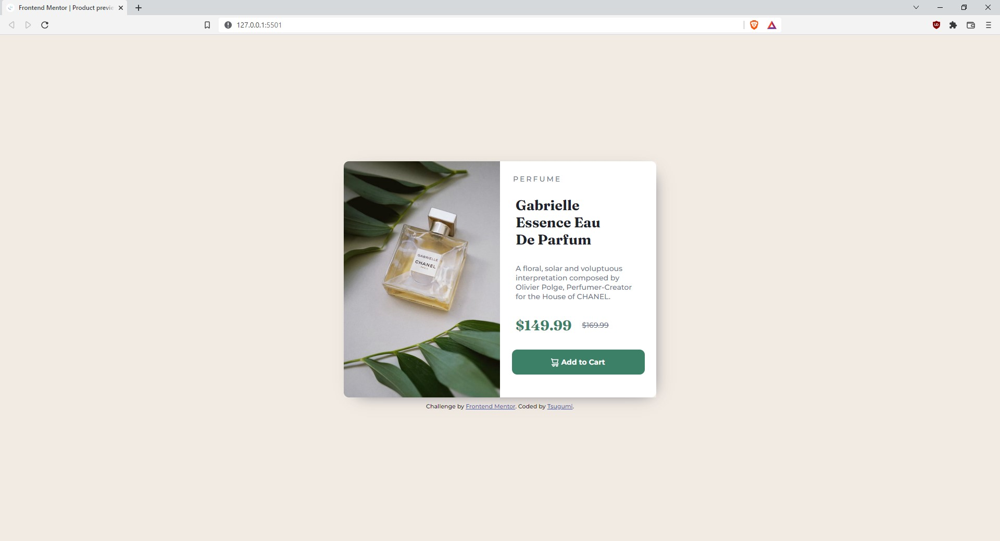

# Frontend Mentor - Product preview card component solution

This is a solution to the [Product preview card component challenge on Frontend Mentor](https://www.frontendmentor.io/challenges/product-preview-card-component-GO7UmttRfa). Frontend Mentor challenges help you improve your coding skills by building realistic projects. 

### Table of contents

- [Frontend Mentor - Product preview card component solution](#frontend-mentor---product-preview-card-component-solution)
    - [Table of contents](#table-of-contents)
  - [Overview](#overview)
    - [Screenshot](#screenshot)
    - [Links](#links)
  - [My process](#my-process)
    - [Built with](#built-with)
  - [Author](#author)

## Overview

### Screenshot

### Links

- Live Site URL: [Github Pages](https://tsugumik.github.io/frontend-mentor-product-prewiev-card-component/)

## My process

### Built with

- HTML5
- Flexbox
- [SCSS](https://sass-lang.com/) - CSS preprocessor with superpowers

## Author

- Discord - [.Błażej#4269](https://discord.com/users/360024962540765184)
- Frontend Mentor - [@Tsugumik](https://www.frontendmentor.io/profile/Tsugumik)
- Github - [@Tsugumik](https://github.com/Tsugumik)
